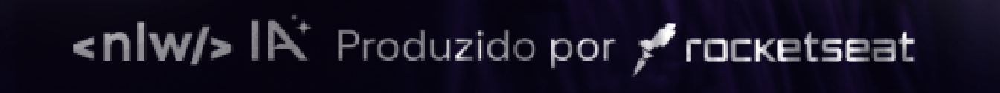
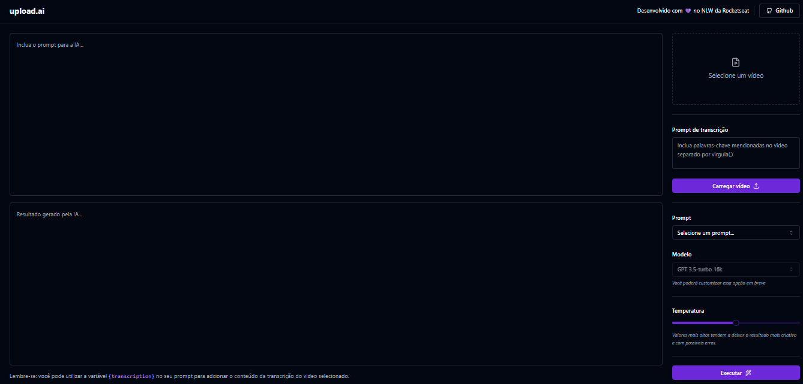

<p align="center">
   <!--   -->
</p>
   <h1 align="center"> upload.ai </h1>
 </p>
 
## 🗂 Conteúdo


- 📋 [Projeto](#-projeto)
  - 🚀 [Tecnologias](#-tecnologias)
  - 📷 [Preview](#-preview)
- 📦 [Instalação](#-instalação)
- ⚖️ [Licença](#%EF%B8%8F-licença)
- 📫 [Contato](#-contato)


## 📋 Projeto


Este projeto inovador, desenvolvido durante o evento (Next Level Week) NLW-IA ministrado pelo [Diego Fernandes](https://github.com/diego3g) da [Rocketseat](https://github.com/Rocketseat), tem como objetivo criar uma aplicação web que utiliza inteligência artificial de ponta para analisar e extrair dados-chave de vídeos de forma automatizada para gerar títulos e descrição de vídeos.


### 🚀 Tecnologias

- [TypeScript][typescript]
- [React][react]
- [VS Code][vc]
- [PNPm][PNPm]
- [Vite][ViteJS]
- [Shadcn/ui][shadcn/ui]
- [Lucide][Lucide]
- [ESlint][eslint]

## 📷 Preview


##### 💻 frontend:

<p align="center"> 
  
</p>

## 📦 Instalação

Para clonar e executar está aplicação, você precisará do [Git](https://git-scm.com), [NodeJS v18.17.1][nodejs] ou superior + [npm v9.17.1][npm] ou superior e o [PNPm 8.7.5][pnpm] instalado no seu computador. No seu terminal rode:

```bash
# Clonando o repositório
$ git clone https://github.com/AndersonSilvaJob/NLW-IA.git
```

```bash
# Instalando o pnpm
$ npm install -g pnpm
```

```bash
# Backend

# Ir até o repositório
$ cd /update-ai-api

# Instalando as dependências
$ pnpm i

# Criando as migrations do banco de dados
$ pnpm prisma migrate dev

# Obs.: Após rodar o comando acima, será solicitado o nome da migration, podemos utilizar o seguinte nome "create videos and prompts"  

----------------------------------------------------------------------------------------------------------------------------------------
# Antes de executar a API, alterar o .env.example para .env e adicionar sua chave da API do OpenAI no .env
----------------------------------------------------------------------------------------------------------------------------------------

# Executar a API
$ pnpm run dev

# Obs.: Após rodar o comando acima, disponibilizará a API no endereço http://localhost:3333
```

```bash
# Frontend

# Ir até o repositório
$ cd /upload-ai-web

# Instalando as dependências
$ pnpm i

# Executar Web
$ pnpm run dev
```


## ⚖️ Licença

Esse projeto está sob a licença [MIT](LICENSE).

## 📫 Contato

by [**Anderson Silva**](https://www.linkedin.com/in/anderson-silva-a5b1b2206/) 🚀

[nodejs]: https://nodejs.org/
[yarn]: https://yarnpkg.com/
[PNPm]: https://pnpm.io/pt/
[npm]: https://www.npmjs.com/
[ViteJS]: https://vitejs.dev/
[shadcn/ui]: https://ui.shadcn.com/
[Lucide]: https://lucide.dev/
[vc]: https://code.visualstudio.com/
[vceditconfig]: https://marketplace.visualstudio.com/items?itemName=EditorConfig.EditorConfig
[vceslint]: https://marketplace.visualstudio.com/items?itemName=dbaeumer.vscode-eslint
[html]: https://www.w3schools.com/html/
[express]: https://expressjs.com/
[nodemon]: https://www.postgresql.org
[expo]: https://expo.io
[react]: https://pt-br.reactjs.org
[reactnative]: https://reactnative.dev
[insomnia]: https://insomnia.rest
[sqlite]: https://www.sqlite.org
[knexjs]: http://knexjs.org
[cors]: https://www.npmjs.com/package/cors
[prettier]: https://prettier.io
[eslint]: https://eslint.org
[celebrate]: https://github.com/arb/celebrate
[typescript]: https://www.typescriptlang.org/
